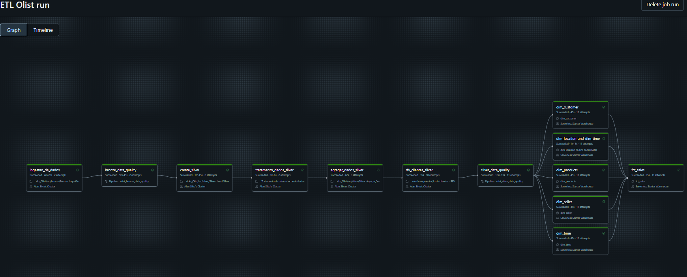

# Projeto de Engenharia de Dados
O projeto a seguir utiliza como base o dataset [Brazilian E-Commerce Public Dataset by Olist](https://www.kaggle.com/datasets/olistbr/brazilian-ecommerce).

## Objetivo
O objetivo do projeto está em demonstrar habilidade de construção de pipelines de ingestão, transformação e carga de dados, e também de gestão, orquestração e monitoramento de qualidade utilizando Databricks.

## Requisitos do projeto:
### Conjunto de Dados do Kaggle: 
- [x] Escolha um conjunto de dados do Kaggle relacionado a vendas. ✅ 2024-07-21
- [x] Certifique-se de que o conjunto de dados inclui informações como datas, produtos, quantidades vendidas, etc. ✅ 2024-07-21

### Projeto de Engenharia de Dados: 
#### Ingestão e Carregamento de Dados:
- [x] Carregue o conjunto de dados no Databricks. ✅ 2024-07-21
- [x] Explore o esquema dos dados e faça ajustes conforme necessário. ✅ 2024-07-21

#### Transformações de Dados: 
- [x] Realize transformações necessárias, como tratamento de valores nulos, conversões de tipos, etc. ✅ 2024-07-22
- [x] Adicione uma coluna calculada, por exemplo, o valor total de cada transação. ✅ 2024-07-22
- [x] Agregue os dados para obter estatísticas de vendas, por exemplo, o total de vendas por produto ou por categoria. ✅ 2024-07-22
- [x] Introduza uma regra mais complexa, como identificar padrões de comportamento de compra ao longo do tempo ou criar categorias personalizadas de produtos com base em determinados critérios. ✅ 2024-07-22
- [x] Saída em Parquet e Delta: Grave os dados transformados e agregados em um formato Parquet para persistência eficiente. ✅ 2024-07-22
- [x] Grave os mesmos dados em formato Delta Lake para aproveitar as funcionalidades de versionamento e transações ACID. ✅ 2024-07-23

#### Exploração Adicional (Opcional): 
- [x] Execute consultas exploratórias para entender melhor os dados e validar as transformações. ✅ 2024-07-22
- [x] Crie visualizações ou relatórios para comunicar insights. ✅ 2024-07-24
- [x] Agende o notebook para execução automática em intervalos regulares para garantir a atualização contínua dos dados. ✅ 2024-07-23
 
## Arquitetura Medalhão
A arquitetura medallion do Databricks é um modelo de design de dados que organiza e estrutura dados em diferentes camadas para otimizar a gestão e análise dos dados. Ela é dividida em três camadas principais:

1. **Bronze (Camada Bruta)**: Armazena dados brutos, não processados, como são recebidos de fontes diversas. Esta camada serve como o repositório inicial, preservando a integridade e granularidade dos dados originais.

2. **Silver (Camada Limpa)**: Contém dados que foram limpos e transformados a partir da camada Bronze. Nesta fase, são removidos erros, duplicações, e são aplicadas transformações para padronizar e estruturar os dados, tornando-os mais utilizáveis para análises.

3. **Gold (Camada Agregada)**: Armazena dados prontos para análise e consumo final. Nesta camada, os dados são agregados e transformados em formatos que atendem a requisitos específicos de negócios, facilitando a geração de relatórios, dashboards e outras análises avançadas.

Essa abordagem em camadas permite uma melhor organização, limpeza e preparação dos dados, melhorando a eficiência do processamento e a qualidade das análises realizadas.

### Workflow
Abaixo a representação de grafos do job.


### Camada Bronze
Demonstrado no arquivo [src/bronze/Bronze: Ingestão](https://github.com/alanceloth/Databricks_Olist/blob/main/src/bronze/Bronze%3A%20Ingest%C3%A3o.py): utilizando a API do Kaggle, foi feita a extração e carga dos dados de maneira bruta.
O objetivo do código nesta camada é fazer um full load dos dados que estão no dataset e entregar tabelas delta com essa informação para a proxima etapa.
```python
if dataset_info:
    print(f"Dataset encontrado: {dataset_info.ref}")
    # Baixar e processar o dataset no DBFS
    download_dataset(api, KAGGLE_DATASET, DBFS_DESTINO)
else:
    print("Dataset não encontrado.")
    
arquivos = dbutils.fs.ls(DBFS_DESTINO)
for arquivo in arquivos:
    if arquivo.path.endswith(".csv"):
        nome_arquivo = os.path.basename(arquivo.path)
        path_processado = os.path.join(DBFS_PROCESSADO, nome_arquivo)
        delta_path = os.path.join(DELTA_TABLE_PATH, nome_arquivo.replace('.csv', ''))
        ultima_atualizacao = verificar_ultima_atualizacao(NOME_PROJETO, KAGGLE_DATASET, nome_arquivo)
        print(f"Processando: {arquivo}")
        processar_arquivo(arquivo.path, path_processado, delta_path, ultima_atualizacao, NOME_PROJETO, KAGGLE_DATASET, nome_arquivo)

remover_arquivos_csv(DBFS_PROCESSADO)
```
A seguir, na camada bronze foi realizado uma etapa de data quality utilizando o decorador `@dlt` (Delta Live Table) em uma pipeline.
O Delta Live Table (DLT) é uma funcionalidade do Databricks que facilita a criação e o gerenciamento de pipelines de dados. Ele simplifica a construção de pipelines ETL (Extração, Transformação e Carga) automatizando a criação e a manutenção de tabelas Delta Lake.

Principais características do Delta Live Table:
1. **Automação de Pipelines:** DLT permite definir pipelines de dados de forma declarativa, especificando como os dados devem ser transformados e processados. Isso reduz a complexidade de codificação manual e facilita a manutenção do pipeline.

2. **Gestão de Qualidade de Dados:** DLT integra verificações de qualidade de dados diretamente no pipeline. Isso significa que regras de qualidade podem ser aplicadas automaticamente durante o processamento dos dados, garantindo a consistência e a integridade dos dados.

3. **Suporte a Delta Lake:** As tabelas geradas por DLT são armazenadas no formato Delta Lake, que fornece funcionalidades avançadas como transações ACID, versionamento de dados e capacidade de time travel, melhorando a confiabilidade e a capacidade de auditoria dos dados.

4. **Escalabilidade e Desempenho:** DLT é otimizado para processamento distribuído no Databricks, permitindo escalabilidade para grandes volumes de dados e melhorando o desempenho das operações de ETL.

5. **Monitoramento e Gestão:** O Databricks fornece ferramentas para monitorar e gerenciar pipelines DLT, oferecendo visibilidade sobre o desempenho do pipeline, status das tarefas e identificando possíveis problemas.

Como funciona o Delta Live Table:
**Definição Declarativa:** Os usuários definem as transformações de dados e a lógica do pipeline utilizando uma linguagem de alto nível, como SQL ou Python, que descreve as tabelas de entrada, as transformações necessárias e as tabelas de saída.
**Implementação Automática:** O Databricks converte essas definições em operações de transformação e carga que são executadas automaticamente.
**Execução e Monitoramento:** O Databricks gerencia a execução das tarefas do pipeline, aplicando otimizações de desempenho e garantindo a qualidade dos dados. O estado e o progresso das tarefas podem ser monitorados em tempo real.

Exemplo de código utilizado no Notebook [src/bronze/Bronze: Data Quality](https://github.com/alanceloth/Databricks_Olist/blob/main/src/bronze/Bronze%3A%20Data%20Quality.py):
```python
expectations = {
    "order_id_not_null": "order_id IS NOT NULL",
    "order_item_id_not_null": "order_item_id IS NOT NULL",
    "product_id_not_null": "product_id IS NOT NULL",
    "seller_id_not_null": "seller_id IS NOT NULL",
    "price_not_null": "price IS NOT NULL",
    "freight_value_not_null": "freight_value IS NOT NULL",
    "price_is_above_zero": "price > 0.0"
}
@dlt.table(comment="Olist Order Items Dataset Bronze Table")
@dlt.expect_all(expectations)
def bronze_olist_order_items_dataset():
    df = spark.table("olist_dataset.bronze.olist_order_items_dataset")
    return df
```

O foco em data quality desta etapa **não é restringir, mas identificar as inconsistências nos dados.** Por isso foi escolhido o `@dlt.expect_all`, que mesmo encontrando problema nos dados, permite que estes sejam carregados na pipeline.


### Camada Silver
Essa camada inicia com a criação das tabelas a partir das VIEWs materializadas criadas na camada de qualidade da bronze, demonstrado no arquivo [src/silver/Silver: Load Silver](https://github.com/alanceloth/Databricks_Olist/blob/main/src/silver/Silver%3A%20Load%20Silver.py). Foi escolhido o uso do SQL para carga pela facilidade de escrita e também para demonstrar o uso da linguagem durante o teste.
Exemplo de código usado nesta etapa:
```sql
 DROP TABLE olist_dataset.silver.olist_geolocation;

 CREATE TABLE IF NOT EXISTS olist_dataset.silver.olist_geolocation (
     geolocation_zip_code_prefix INT,
     geolocation_lat DOUBLE,
     geolocation_lng DOUBLE,
     geolocation_city STRING,
     geolocation_state STRING
 )
 USING DELTA;

 MERGE INTO olist_dataset.silver.olist_geolocation AS target
 USING (
     SELECT
         geolocation_zip_code_prefix,
         CAST(geolocation_lat AS DOUBLE) AS geolocation_lat,
         CAST(geolocation_lng AS DOUBLE) AS geolocation_lng,
         geolocation_city,
         geolocation_state
     FROM
         olist_dataset.bronze.bronze_olist_geolocation_dataset
 ) AS source
 ON target.geolocation_zip_code_prefix = source.geolocation_zip_code_prefix

 WHEN NOT MATCHED THEN
     INSERT (
         geolocation_zip_code_prefix,
         geolocation_lat,
         geolocation_lng,
         geolocation_city,
         geolocation_state
     ) VALUES (
         source.geolocation_zip_code_prefix,
         source.geolocation_lat,
         source.geolocation_lng,
         source.geolocation_city,
         source.geolocation_state
     );
```

A escolha do Merge into está ligada à caso existam dados com o mesmo valor na tabela, não serem inseridos novamente.

Em seguida foi realizado o tratamento dos dados reportados na camada bronze e na análise exploratória [src/silver/Silver: Tratamento de nulos e inconsistências](https://github.com/alanceloth/Databricks_Olist/blob/main/src/silver/Silver%3A%20Tratamento%20de%20nulos%20e%20inconsist%C3%AAncias.py)
Aqui uma das soluções interessantes é o tratamento de cidades com nomes incorretos, explicado no [vídeo demonstrativo](https://youtu.be/J-lzNft9tX4?si=yxhPYxjeq0Ec53TR&t=1678). 

Depois foram realizadas agregações nos dados [src/silver/Silver: Agregações](https://github.com/alanceloth/Databricks_Olist/blob/main/src/silver/Silver%3A%20Agrega%C3%A7%C3%B5es.py), como por exemplo, a inserção de uma coluna com o valor total do pedido:
```python
from pyspark.sql.functions import sum as spark_sum

# Carregar as tabelas
df_orders = spark.read.table("olist_dataset.silver.olist_orders")
df_order_items = spark.read.table("olist_dataset.silver.olist_order_items")

# Verificar se a coluna 'total_order_value' já existe na tabela de pedidos e renomear se necessário
if 'total_order_value' in df_orders.columns:
    df_orders = df_orders.drop('total_order_value')

# Fazer a junção das tabelas
df_joined = df_orders.join(df_order_items, df_orders["order_id"] == df_order_items["order_id"], "left")

# Calcular o valor total da venda para cada pedido
df_total_order_value = df_joined.groupBy(df_orders["order_id"]).agg(spark_sum("price").alias("total_order_value"))

# Adicionar a coluna de valor total de venda à tabela de pedidos
df_orders_with_total = df_orders.join(df_total_order_value, "order_id", "left")

# Salvar a tabela atualizada como Delta Table
try:
  df_orders_with_total.write.format("delta").mode("overwrite").option("mergeSchema", "true").saveAsTable("olist_dataset.silver.olist_orders")
except:
  df_orders_with_total.write.format("delta").mode("overwrite").option("overwriteSchema", "true").saveAsTable("olist_dataset.silver.olist_orders")
```

E a criação de tabelas com valores agregados para análise, salvando o resultado em formato Delta e Parquet:
```python
# Criar a Temp View
query = """
WITH product_counts AS (
    SELECT A.product_category_name, COUNT(B.product_id) AS quantity
    FROM olist_dataset.silver.olist_products AS A
    LEFT JOIN olist_dataset.silver.olist_order_items AS B ON A.product_id = B.product_id
    LEFT JOIN olist_dataset.silver.olist_orders O ON B.order_id = O.order_id
    WHERE O.order_status IN ('delivered', 'invoiced', 'shipped', 'approved')
    GROUP BY A.product_category_name
)
SELECT 
    product_category_name, 
    quantity, 
    (quantity * 100.0 / SUM(quantity) OVER ()) AS percentage_of_total
FROM 
    product_counts
ORDER BY 
    quantity DESC;
"""

# Carregar os dados da Temp View
produtos_vendidos_por_categoria  = spark.sql(query)

# Salvar em formato Delta
produtos_vendidos_por_categoria .write.format("delta").mode("overwrite").save("/Volumes/olist_dataset/silver/silver_volume/delta/produtos_vendidos_por_categoria ")

# Salvar em formato Parquet
produtos_vendidos_por_categoria .write.format("parquet").mode("overwrite").save("/Volumes/olist_dataset/silver/silver_volume/parquet/produtos_vendidos_por_categoria ")
```

Depois das agregações, foi criado um modelo de segmentação dos clientes utilizando a estratégia RFV (Recência, Frequência e Valor), demonstrado aqui [src/silver/Silver: Modelo de segmentação de clientes - RFV](https://github.com/alanceloth/Databricks_Olist/blob/main/src/silver/Silver%3A%20Modelo%20de%20segmenta%C3%A7%C3%A3o%20de%20clientes%20-%20RFV.py).
### RFV (Recência, Frequência e Valor)

RFV, ou Recência, Frequência e Valor (em inglês, RFM: Recency, Frequency, Monetary Value), é uma técnica de análise de comportamento de clientes utilizada para segmentar e compreender melhor os consumidores de um negócio. Ela avalia três dimensões principais:

1. **Recência (R)**: Mede o tempo desde a última compra de um cliente. Clientes que compraram recentemente são mais propensos a responder a ofertas futuras.

2. **Frequência (F)**: Mede o número de vezes que um cliente comprou durante um período específico. Clientes que compram com mais frequência são considerados mais leais.

3. **Valor Monetário (V)**: Mede o valor total gasto por um cliente durante um período específico. Clientes que gastam mais são considerados mais valiosos.

### Aplicações do RFV:
- **Segmentação de Clientes**: Identificar diferentes grupos de clientes com base em seus comportamentos de compra.
- **Marketing Direcionado**: Desenvolver campanhas específicas para diferentes segmentos, como recompensar clientes leais ou reativar clientes inativos.
- **Melhoria da Retenção**: Identificar e focar em clientes com alto valor e alta frequência de compra para aumentar a retenção.

Essa análise ajuda as empresas a entender melhor seus clientes e a tomar decisões informadas sobre estratégias de marketing e vendas.

E por fim uma etapa de Data quality demonstrado no código [src/silver/Silver: Data Quality](https://github.com/alanceloth/Databricks_Olist/blob/main/src/silver/Silver%3A%20Data%20Quality.py), onde há uma mudança nas expectativas. Aqui como já passou pelas etapas de tratamento de dados, o decorador utilizado é o `@dlt.expect_all_or_fail(expectations)`. No qual caso uma das constraints falhe, os dados não são carregados nas etapas a seguir.
Exemplo de código:
```python
expectations = {
    "geolocation_city_not_null": "geolocation_city IS NOT NULL",
    "geolocation_state_not_null": "geolocation_state IS NOT NULL",
    "geolocation_zip_code_prefix_not_null": "geolocation_zip_code_prefix IS NOT NULL"
}
@dlt.table(comment="Olist Geolocation Dataset Silver Table")
@dlt.expect_all_or_fail(expectations)
def silver_olist_geolocation():
    df = spark.table("olist_dataset.silver.olist_geolocation")
    return df
```
### Camada Gold
A camada Gold foi criada utilizando queries diretamente no Databricks SQL, e não possue suporte de versionamento deste tipo de arquivo. Posteriormente foi feito o upload manualmente no [github dos arquivos .sql da camada](https://github.com/alanceloth/Databricks_Olist/tree/main/src/gold)

> Unsupported files found
> Unsupported assets, such as Dashboards, can't be committed to the remote repository and are disabled here.
> 
Exemplo de código utilizado:
```sql
DROP TABLE IF EXISTS olist_dataset.gold.dim_customer;

CREATE TABLE IF NOT EXISTS olist_dataset.gold.dim_customer (
    customer_id STRING PRIMARY KEY,
    customer_unique_id STRING,
    customer_zip_code_prefix STRING,
    customer_city STRING,
    customer_state STRING
);

INSERT INTO olist_dataset.gold.dim_customer (
    customer_id, 
    customer_unique_id, 
    customer_zip_code_prefix, 
    customer_city, 
    customer_state
)
SELECT 
    customer_id AS customer_id, 
    customer_unique_id AS customer_unique_id, 
    CAST(customer_zip_code_prefix AS STRING) AS customer_zip_code_prefix, 
    customer_city AS customer_city, 
    customer_state AS customer_state
FROM 
    olist_dataset.silver.silver_olist_customers;
```

### Dashboard
O dashboard utilizou principalmente a camada gold para relatoria, e algumas queries personalizadas para visuais específicos.

Exemplo de top 10 produtos por categoria de produto
```sql
WITH product_counts AS (
    SELECT 
        product_category_name, 
        SUM(quantity) AS total_quantity
    FROM 
        olist_dataset.gold.fct_sales
    JOIN 
        olist_dataset.gold.dim_products 
    ON 
        fct_sales.product_id = dim_products.product_id
    GROUP BY 
        product_category_name
),
top_10_categories AS (
    SELECT 
        product_category_name
    FROM 
        product_counts
    ORDER BY 
        total_quantity DESC
    LIMIT 10
),
product_counts_with_rank AS (
    SELECT 
        pc.product_category_name,
        pc.total_quantity,
        CASE 
            WHEN t10.product_category_name IS NOT NULL THEN pc.product_category_name
            ELSE 'OUTROS'
        END AS category_group
    FROM 
        product_counts pc
    LEFT JOIN 
        top_10_categories t10 ON pc.product_category_name = t10.product_category_name
)
SELECT 
    category_group AS product_category_name,
    SUM(total_quantity) AS total_quantity
FROM 
    product_counts_with_rank
GROUP BY 
    category_group
ORDER BY 
    total_quantity DESC;
```

# Contato
- [LinkedIn](https://www.linkedin.com/in/alanlanceloth/)
- [GitHub](https://github.com/alanceloth/)
- [alan.lanceloth@gmail.com](mailto:alan.lanceloth@gmail.com)
